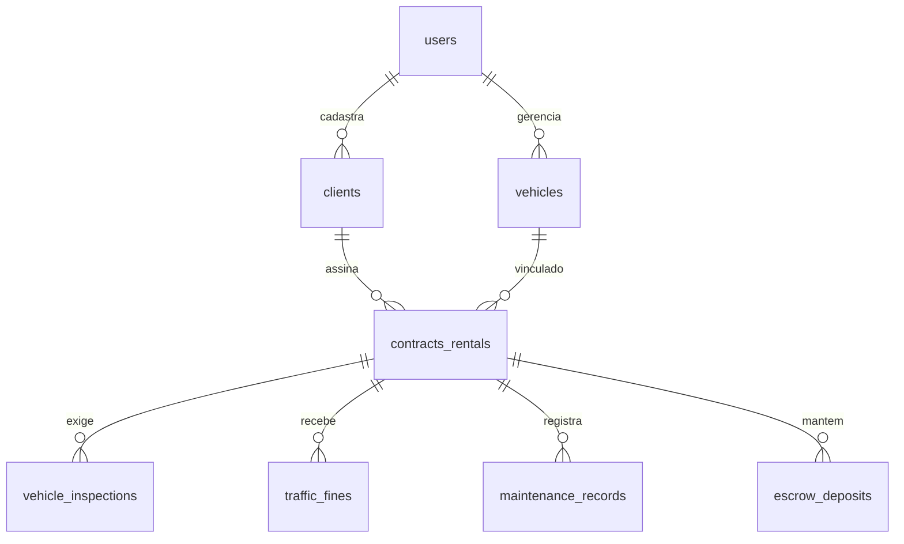
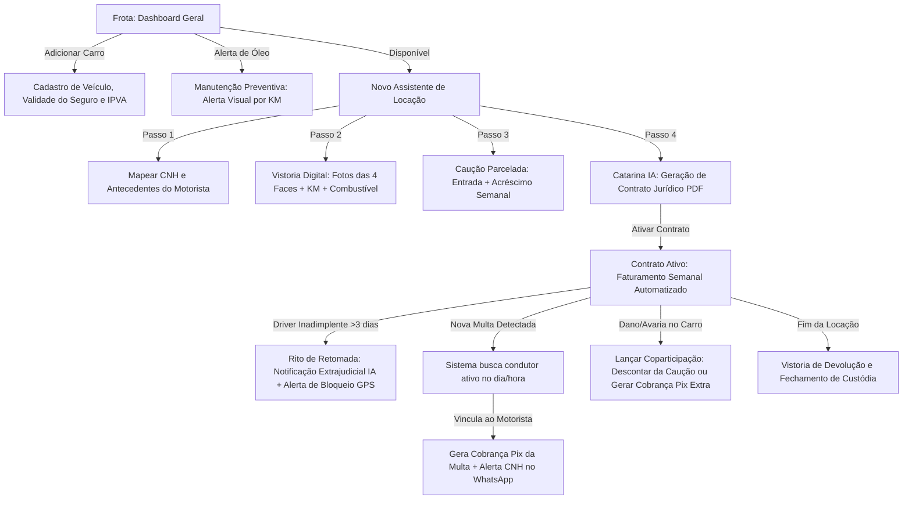

# Plano de Melhoria Ultra-Premium: Ecossistema de Locação de Veículos (Cobbra.ai)

Este documento detalha o plano de produto expandido, profundo e realista para o **Módulo de Locação de Veículos**. Ele foi reestruturado para mapear a jornada operacional real de um locador de pequena/média escala, cobrindo não apenas o controle financeiro, mas também a segurança jurídica, mitigação de roubo, gestão de coparticipação de sinistros, caução parcelada, mensagens editáveis e divisão de lucros com investidores.

---

## 1. Mapeamento Profundo da Vida do Locador de Carros (A Rotina Real)

Para criar um sistema que realmente atenda o locador, dividimos a operação diária dele em **6 dores de cabeceira silenciosas** que o Excel ou ferramentas financeiras tradicionais não resolvem:

### Dor 1: CNH Vencida ou Suspensa e Sinistros de Seguro
* **A Realidade:** Se o motorista cometer um acidente com a CNH vencida ou suspensa, a seguradora **não cobre** os danos. O prejuízo é 100% do locador. Além disso, entregar veículo a condutor não habilitado é crime de trânsito (Art. 310 do CTB).
* **O Processo Diário:** O locador precisa acompanhar a validade da CNH dos motoristas e a pontuação do Detran ativamente.

### Dor 2: Caução Parcelada (O motorista nunca tem o valor à vista)
* **A Realidade:** A caução (geralmente R$ 1.500) serve para cobrir danos e multas futuras. Porém, quase nenhum motorista de aplicativo tem esse dinheiro à vista antes de pegar o carro.
* **O Processo Diário:** O locador parcela a caução: e.g. R$ 500 à vista + R$ 100 junto com as primeiras 10 parcelas do aluguel semanal. O controle disso é caótico sem um painel dedicado de amortização de caução.

### Dor 3: Divisão de Responsabilidade de Manutenção (Coparticipação)
* **A Realidade:** Desgaste natural (óleo, correia, pneus por KM) é custo do **Locador**. Mau uso (furos de pneu, quebra de retrovisor, embreagem queimada por vício de direção) ou batidas leves são de responsabilidade do **Motorista**.
* **O Processo Diário:** O carro vai para a oficina, o locador paga para liberar o ativo rápido, mas precisa cobrar o motorista de forma parcelada ou descontar da caução de forma clara.

### Dor 4: Gestão de Investidores de Carros (Parceiros/Uncle Fleet)
* **A Realidade:** A maioria dos micro-locadores não é dona de todos os carros. Eles começam administrando carros de terceiros (tios, primos, investidores) em troca de uma taxa de administração (geralmente 15% a 25%).
* **O Processo Diário:** No fim do mês, o locador precisa fazer o "Split/Repasse de Investidor", deduzindo os custos de manutenção, multas, inadimplência e taxa de gestão para repassar o lucro líquido correto para o dono do carro.

### Dor 5: O Rito de Inadimplência e Bloqueio (O Protocolo de Pânico)
* **A Realidade:** Aluguéis de aplicativo são semanais. Se o motorista atrasar mais de 3 dias e não atender o WhatsApp, o locador **bloqueia o motorista via rastreador GPS**. Mas para fazer a retomada do veículo fisicamente, ele precisa de amparo jurídica imediato.
* **O Processo Diário:** O locador precisa gerar uma **Notificação Extrajudicial de Despejo e Retomada de Posse** formal imediatamente, o que muitas vezes exige pagar advogados de última hora.

---

## 2. Nova Arquitetura de Banco de Dados Expandida (Drizzle/SQLite)

Para suportar essas complexidades operacionais, o banco de dados será composto pelas seguintes tabelas:

### 1. `vehicles` (Frota)
- `id` (TEXT PRIMARY KEY) - UUID do veículo.
- `user_id` (TEXT NOT NULL) - Administrador do veículo.
- `investor_name` (TEXT) - Nome do investidor proprietário (caso o carro seja de terceiros).
- `investor_split_rate` (REAL) - Porcentagem de repasse do investidor (ex: 80.0 para 80%).
- `model` (TEXT NOT NULL) - Ex: "Fiat Uno 1.0", "Chevrolet Onix".
- `plate` (TEXT NOT NULL UNIQUE) - Placa do carro.
- `color` (TEXT NOT NULL) - Cor do veículo.
- `year` (INTEGER) - Ano do modelo.
- `renavam` (TEXT) - Renavam.
- `chassis` (TEXT) - Chassi.
- `current_km` (INTEGER DEFAULT 0) - KM atual do carro.
- `status` (TEXT DEFAULT 'available') - Status: `'available'`, `'rented'`, `'maintenance'`, `'damaged'`.
- `oil_change_interval_km` (INTEGER DEFAULT 10000) - Intervalo de troca de óleo.
- `last_oil_change_km` (INTEGER DEFAULT 0) - KM da última troca de óleo.
- `insurance_policy` (TEXT) - Número da apólice do seguro.
- `insurance_expires_at` (TEXT) - Validade do seguro.

### 2. `clients` (Motoristas - Campos específicos adicionados via Drizzle)
- Adicionar no schema de `clients`:
  - `cnh_number` (TEXT) - Número da CNH.
  - `cnh_category` (TEXT) - Categoria CNH (B, AB, etc.).
  - `cnh_expires_at` (TEXT) - Validade da CNH (Crítico para alertas!).
  - `security_background_status` (TEXT DEFAULT 'pending') - Status da consulta de antecedentes: `'pending'`, `'approved'`, `'rejected'`.

### 3. `contracts_rentals` (Locações/Contratos)
- `id` (TEXT PRIMARY KEY) - UUID do contrato.
- `user_id` (TEXT NOT NULL) - Administrador.
- `client_id` (TEXT NOT NULL) - Motorista.
- `vehicle_id` (TEXT NOT NULL) - Veículo.
- `start_date` (TEXT NOT NULL) - Início.
- `end_date` (TEXT) - Fim da locação.
- `rent_amount` (REAL NOT NULL) - Valor semanal ou mensal.
- `billing_cycle` (TEXT DEFAULT 'weekly') - `'weekly'` (Semanal), `'monthly'` (Mensal).
- `status` (TEXT DEFAULT 'active') - `'active'`, `'completed'`, `'paused_debt'`.
- `contract_html` (TEXT) - Contrato gerado pela IA.

### 4. `escrow_deposits` (Gestão da Caução Parcelada)
- `id` (TEXT PRIMARY KEY) - UUID do depósito.
- `contract_id` (TEXT NOT NULL) - Contrato associado.
- `total_target_amount` (REAL NOT NULL) - Valor total acordado (ex: R$ 1.500).
- `upfront_amount` (REAL NOT NULL) - Entrada paga (ex: R$ 500).
- `installments_count` (INTEGER DEFAULT 0) - Parcelas adicionais de caução.
- `installments_amount` (REAL DEFAULT 0) - Valor de cada parcela de caução (ex: R$ 100 por semana).
- `balance_paid` (REAL DEFAULT 0) - Valor total já pago da caução pelo motorista.
- `status` (TEXT DEFAULT 'pending_accrual') - `'pending_accrual'` (Em acumulação), `'fully_paid'` (Quitado), `'refunded'` (Devolvido), `'discounted'` (Retido por danos).

### 5. `vehicle_inspections` (Vistoria Digital Fotográfica)
- `id` (TEXT PRIMARY KEY) - UUID da vistoria.
- `contract_id` (TEXT NOT NULL) - Contrato associado.
- `type` (TEXT NOT NULL) - `'pickup'` (Entrega), `'return'` (Devolução), `'routine'` (Revisão periódica).
- `km` (INTEGER NOT NULL) - KM registrado.
- `fuel_level` (TEXT NOT NULL) - `'empty'`, `'1/4'`, `'2/4'`, `'3/4'`, `'full'`.
- `cleanliness` (TEXT NOT NULL) - `'dirty'`, `'regular'`, `'clean'`.
- `general_condition_notes` (TEXT) - Checklist de arranhões e amassados.
- `photo_front` (TEXT) - Base64 ou URL da foto frontal.
- `photo_back` (TEXT) - Base64 ou URL da foto traseira.
- `photo_left` (TEXT) - Base64 ou URL da lateral esquerda.
- `photo_right` (TEXT) - Base64 ou URL da lateral direita.

### 6. `maintenance_records` (Coparticipação de Custos)
- `id` (TEXT PRIMARY KEY) - UUID da manutenção.
- `vehicle_id` (TEXT NOT NULL) - Veículo.
- `contract_id` (TEXT) - Contrato ativo.
- `description` (TEXT NOT NULL) - Ex: "Troca de embreagem", "Conserto de pneu furado".
- `total_cost` (REAL NOT NULL) - Custo total.
- `responsibility` (TEXT DEFAULT 'owner') - Quem paga: `'owner'` (Dono do carro), `'driver'` (Motorista), `'split'` (Dividido).
- `driver_share_amount` (REAL DEFAULT 0) - Valor a ser cobrado do motorista (se `'driver'` ou `'split'`).
- `driver_charge_mode` (TEXT DEFAULT 'direct_charge') - Forma de cobrança: `'direct_charge'` (Lançar fatura Pix extra), `'deduct_deposit'` (Descontar do saldo da caução).

### 7. `traffic_fines` (Gestão de Multas Automática)
- `id` (TEXT PRIMARY KEY) - UUID da multa.
- `vehicle_id` (TEXT NOT NULL) - Veículo.
- `contract_id` (TEXT) - Contrato ativo na data (calculado pela IA/Sistema).
- `infraction_date` (TEXT NOT NULL) - Data e hora exatas.
- `description` (TEXT NOT NULL) - Descrição da infração.
- `amount` (REAL NOT NULL) - Valor nominal.
- `points` (INTEGER) - Pontuação na CNH.
- `driver_indicated` (INTEGER DEFAULT 0) - Condutor indicado no Detran? (0 - Não, 1 - Sim).
- `status` (TEXT DEFAULT 'pending') - `'pending'` (Aguardando reembolso), `'reimbursed'` (Pago pelo motorista).

---

## 3. Os 5 Super-Módulos do Novo Painel de Locações

Para oferecer uma ferramenta de nível de mercado, o painel de **Locações** será estruturado em abas dinâmicas de altíssima utilidade operacional:

### Aba 1: Painel Geral da Frota (Visão "Estacionamento")
* **O que exibe:** Grid de cards ultra-visuais de cada carro cadastrado.
* **Ações Rápidas por Veículo:**
  - Botão de status dinâmico para mudar para "Na Oficina", "Disponível" ou "Alugado".
  - **Indicador de Saúde de Manutenção:** Barra de progresso da troca de óleo (KM atual vs KM limite). Se estiver perto do limite, o card pisca em amarelo `⚠️ Troca de Óleo Pendente`.
  - Exibe o nome do Motorista Ativo e link direto para o WhatsApp dele.

### Aba 2: Novo Assistente de Locação Inteligente (Mascote Catarina IA)
* **Passo 1 (Seleção de Veículo e Condutor):** Seleciona um veículo disponível da frota e um motorista pré-cadastrado no CRM (com validação em tempo real da validade da CNH do condutor).
* **Passo 2 (Vistoria Inicial de Entrega):** O locador preenche o KM atual, nível de gasolina e anexa **4 fotos tiradas na hora pelo celular** das 4 faces do carro.
* **Passo 3 (Caução Parcelada e Valores):**
  - Define o valor semanal.
  - Configura o Depósito de Caução: ex: R$ 1.500 no total, sendo R$ 500 pagos como entrada no Pix hoje + 10 parcelas adicionais de R$ 100 embutidas nos próximos 10 aluguéis semanais.
* **Passo 4 (Geração de Contrato Jurídico pela Catarina IA):**
  - A IA escreve o contrato completo baseado no modelo comercial aprovado.
  - O locador visualiza a prévia, edita cláusulas por chat se necessário, envia por WhatsApp e pode baixar em PDF.

### Aba 3: Conciliação Financeira de Danos & Caução em Custódia
* **O que faz:** Controla a conta de caução do motorista.
* **Visualização:** Exibe o saldo acumulado de caução do motorista em tempo real.
* **Ações de Amortização e Desconto:**
  - Se o motorista quebrar o retrovisor (custo de R$ 250), o locador pode clicar em **"Lançar Despesa de Coparticipação"** e escolher **"Descontar da Caução"**.
  - O sistema abate R$ 250 do saldo retido, atualizando o extrato do motorista que é compartilhado diretamente no WhatsApp dele por um link público e transparente.

### Aba 4: Gestão e Localização Automática de Multas (Catarina Fine Finder)
* **O que faz:** Simplifica a imputação de infrações de trânsito.
* **Como funciona:** O locador recebe a multa no aplicativo do Detran. No painel da Cobbra, ele clica em **"Lançar Nova Multa"**:
  - Digita a Placa e a Data/Hora exatas da infração.
  - **O sistema automaticamente consulta a base de contratos ativos** e descobre que o motorista estava em posse daquele carro naquele instante.
  - O sistema vincula a multa ao contrato do motorista correto, atualiza a pontuação na CNH virtual do motorista no CRM e **gera uma cobrança Pix automática** do valor correspondente.
  - **Templates de Mensagem 100% Editáveis:** Em vez de disparar mensagens automaticamente, o sistema **sempre** exibirá uma caixa de texto (`textarea`) contendo o template de cobrança de multa pré-preenchido pela IA. O locador poderá revisar, alterar o tom, adicionar detalhes e editar 100% da mensagem antes de clicar em "Disparar WhatsApp".

### Aba 5: O Rito de Inadimplência e Notificação de Bloqueio (Protocolo de Pânico)
* **O que faz:** Ampara juridicamente o locador em caso de não-pagamento ou suspeita de apropriação indébita.
* **Como funciona:** Se a fatura semanal vencer e o motorista ficar inadimplente por mais de 3 dias, um botão **"Acionar Rito de Retomada"** é liberado ao lado do contrato.
* **Ações:**
  - O sistema gera instantaneamente uma **Notificação Extrajudicial de Despejo e Rescisão Contratual por Inadimplência** em PDF profissional, assinada eletronicamente.
  - O sistema exibe um **Template de Mensagem Editável** em caixa de texto redigido pela Catarina IA para alertar sobre o bloqueio do rastreador GPS em 12 horas. O locador pode revisar, modificar e personalizar 100% do texto antes de autorizar o envio no WhatsApp.

### Aba 6: Relatório de Repasse para Investidores (Revenue Share)
* **O que faz:** Gera o extrato de prestação de contas mensal para os donos dos carros.
* **Como funciona:** No fim do mês, o locador filtra o carro "Placa ABC-1234" (que pertence ao Investidor Carlos):
  - O sistema lista: Faturamentos recebidos do motorista (R$ 2.000) menos Taxa de Gestão do Locador (20% - R$ 400) menos custos de manutenção natural (Troca de óleo - R$ 150).
  - Gera o **Extrato de Repasse Líquido** (R$ 1.450 a ser transferido para o Investidor Carlos) com um clique.

---

## 4. Diagrama da Nova Experiência Premium de Locações

---
