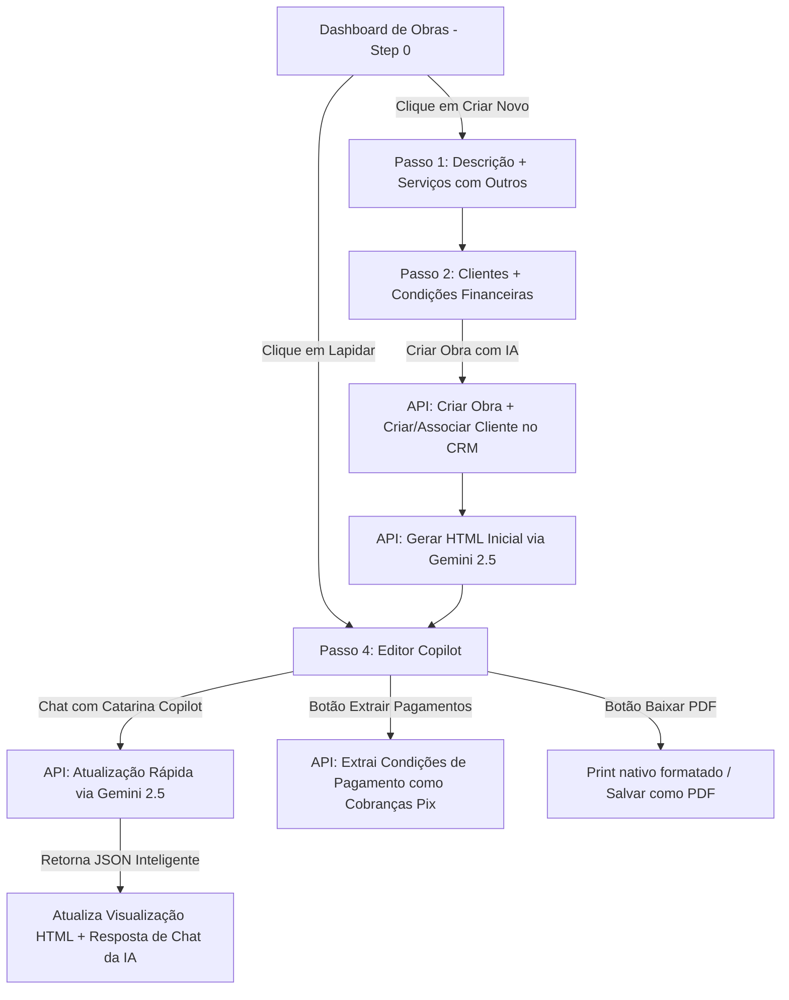

# Plano de Refinamento: Módulo Obras e Orçamentos (Construção Civil)

Este documento detalha o plano de arquitetura e implementação para os refinamentos solicitados no módulo de Obras e Orçamentos da Cobbra.ai.

---

## 1. Fluxo de UI/UX no Catarina Copilot (Passo 4 - Editor)
* **Objetivo:** Tornar o chat do Copilot mais limpo após a geração inicial e adicionar uma marca d'água/direcionamento visual claro para o usuário.
* **Alterações propostas:**
  - **Ocultação das Sugestões Rápidas:** Após a geração inicial do contrato, o painel lateral ocultará o carrossel de sugestões rápidas, deixando o espaço 100% limpo para o chat e histórico.
  - **Placeholder Visual de Fundo (Watermark):** Quando o histórico de chat do Copilot estiver vazio ou apenas contiver a mensagem inicial de boas-vindas, exibiremos um texto centralizado de baixa opacidade no fundo do chat contendo:
    > 🪄 **Catarina Copilot Ativo**
    >
    > Digite no campo abaixo as instruções para alterar seu contrato.
    > *Exemplo: "Altere o valor para R$ 90.000", "Adicione garantia de 5 anos", "Substitua a marca da tinta para Suvinil".*

---

## 2. Persistência de Contratos e Dashboard de Obras (Salvar e Carregar)
* **Objetivo:** Permitir que o usuário visualize todas as suas obras e orçamentos criados, podendo reabri-los a qualquer momento para novas alterações.
* **Design de Banco de Dados (SQLite):**
  - Utilizaremos as tabelas `projects` e `documents` já existentes no SQLite.
* **Design de API (GET `/api/ai/budget-generator`):**
  - Implementaremos o método `GET` na rota para suportar duas operações:
    1. **Listagem Geral (`GET /api/ai/budget-generator`):** Retorna todos os projetos (`projects`) do usuário logado, trazendo informações do cliente associado (`client_name`), valor total (`total_value`), status e versão.
    2. **Busca Detalhada (`GET /api/ai/budget-generator?project_id=[id]`):** Retorna os detalhes completos do projeto, dados do cliente e o HTML do documento mais recente (`content_html` da tabela `documents`).
* **Design de UI (Novo Dashboard Step 0):**
  - Quando o usuário com `business_niche = 'construcao_civil'` entrar em `/dashboard/obras`, a página iniciará no **Step 0 (Dashboard Geral)**.
  - Se não houver obras criadas, exibe um card de introdução convidativo.
  - Se houver obras, exibe um painel de gerenciamento moderno (layout estilo Stripe) com uma tabela listando as obras:
    - **Nome do Projeto / Obra**
    - **Cliente**
    - **Valor**
    - **Status** (Orçamento, Em Andamento, Concluído)
    - **Ações:** 
      - 📝 *Lapidar / Alterar Orçamento:* Abre o projeto diretamente no Step 4 (Editor com Copilot) carregando o histórico e HTML mais recente.
      - 🗑️ *Excluir:* Remove o projeto e documento associado.

---

## 3. Simplificação e Ajustes no Wizard de Criação (Passos 1 e 2)
* **Objetivo:** Deixar o formulário inicial mais limpo e focado, e adicionar suporte a escopos genéricos.
* **Passo 1 (Informações Básicas):**
  - **Remover as 4 Sugestões de Descrição:** Eliminaremos os botões rápidos de exemplo abaixo do input de descrição do projeto.
  - **Serviço "Outros" (Contrato Genérico):** Adicionaremos o item `"Outros"` na lista de serviços incluídos. Quando selecionado, a IA gerará um contrato genérico de prestação de serviços técnicos/gerais de engenharia, em vez de se prender a escopos específicos de pintura, lavagem ou estrutura.
* **Passo 2 (Condições Financeiras):**
  - **Remover as 4 Sugestões Financeiras:** Excluiremos os botões `['30/30/40', '50/50', '3x mensais', 'Medição semanal']` que sugeriam formas de pagamento.
  - **Helper Text Intuitivo:** Adicionaremos a frase direcionadora acima do textarea: *"Explique aqui como e de que forma você vai receber pelo projeto."*

---

## 4. Agilidade da IA e Copilot 100% Interativo
* **Objetivo:** Reduzir a latência do Copilot e tornar a conversa com a Catarina extremamente dinâmica e natural.
* **Estratégias de Otimização de Performance:**
  - **Utilização Exclusiva do Gemini 2.5 Flash:** Modelo ultrarrápido com altíssima velocidade de geração e excelente compreensão de contexto HTML.
  - **Prompting de Retorno de Estrutura Híbrida (JSON):** 
    - Modificaremos a Catarina para retornar um JSON estruturado contendo:
      ```json
      {
        "html": "...", // O HTML do contrato atualizado (somente se houver alteração)
        "ai_response": "..." // Uma resposta amigável, ágil e curta da Catarina explicando a alteração feita!
      }
      ```
    - Desta forma, a Catarina responderá no chat de forma natural e personificada (ex: *"Prontinho! Removi a cláusula de pintura interna e já recalculei o total para você. Dá uma olhada ao lado!"*), em vez de usar mensagens estáticas e robóticas no frontend.

---

## 5. Renomeação de Termos Financeiros
* **Objetivo:** Alinhamento de jargão de construção civil com gestão de pagamentos da Cobbra.
* **Alteração:**
  - No painel lateral, o bloco de "Sincronização Financeira" agora exibirá o botão **"💸 Extrair Pagamentos"** no lugar de "Extrair Parcelas de Medição".

---

## Diagrama do Fluxo de Arquitetura



---
